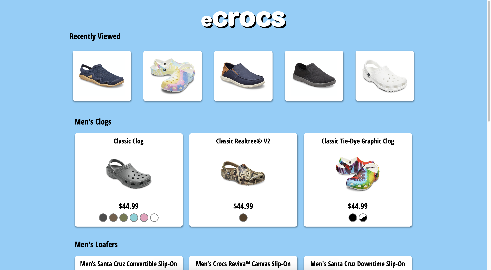
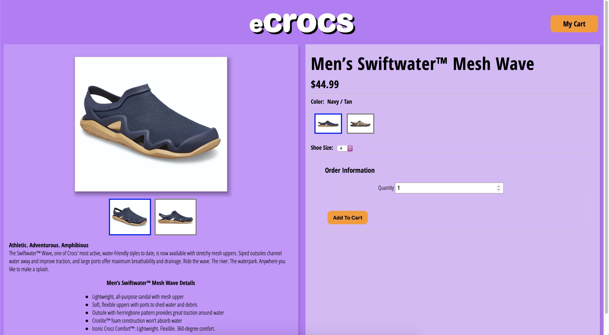
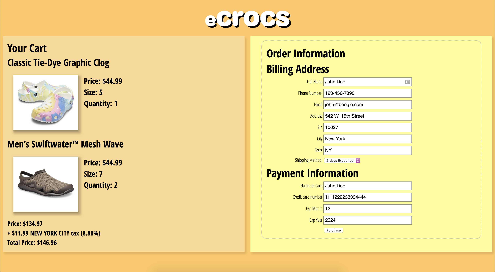
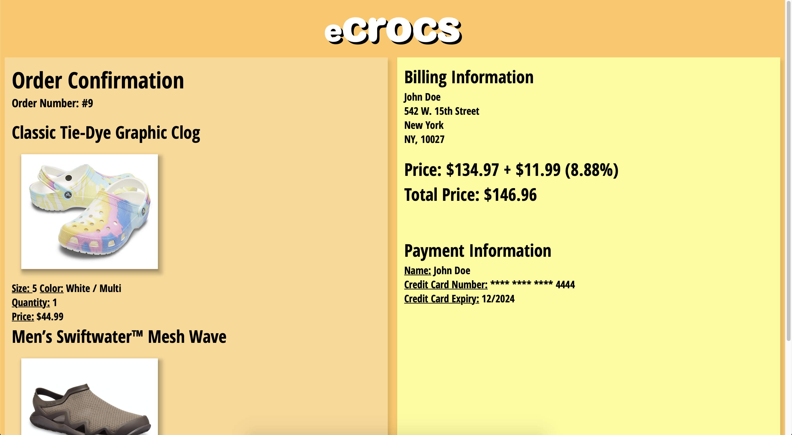

# IN4MATX 124

## Project 3

```
Members:
Joshua Kuan (52594796)
Garry Fanata (39583521)
```

We are group 13, this project is NOT hosted on circinus-13. A zoom meeting is scheduled to demo this application.

This application was built and developed using Tomcat 9.0.35.

Github Repo: `https://github.com/cwjoshuak/inf124-ecommerce-p3`

Our site consists of 5 main pages:-

- the home page: `index.jsp`
- products list page: `/products`
- individual product page: `/product`
- checkout  page: `/checkout`
- order confirmation page: `/order_confirmation`


### Requirement Satisfaction

1. Our homepage is a static .jsp file. It contains information regarding the website and our group. The products page is served with a servlet at `/products`.  This servlet uses `RequestDispatcher` `include` to serve content from a second servlet, at `/api/recentlyviewed`. A `HttpSession` is created when the user first enters the `/products` page. This `RecentlyViewed` servlet uses the newly created `HttpSession` to display up to 5 of the user's recently viewed products. 
2. The product details page lives at `/product`, taking the shoe id as a parameter and displaying information regarding the product. There is an Add to Cart button on the page, which allows the user to add the product into their cart after they are done customizing. The button press will trigger a `POST` request, The item is stored into a servlet session attribute.
3. The checkout page is at `/checkout`. The servlet retrieves the cart information from the session and displays it. The checkout page also contains a order form. Filling in the ZIP code will automatically prefill the City and State fields through AJAX with a `POST` request to `/api/getCityState`. The form features basic HTML form validation. Clicking the purchase button will insert the items from the cart into the SQL tables `transaction_details` and `transactions`. The servlet will then use `RequestDispatcher` `forward` to forward the user to the order confirmation page at `/order_confirmation`.

### Screenshots







#### Notes:

- Files from project 2 have been reorganized.
- Necessary sql files are in the `sql/` folder.
